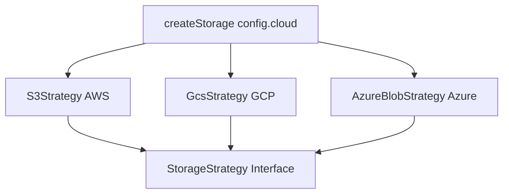

# React Component Specifications

## CloudTabs

Reusable tab component showing cloud-specific code examples.

**Props**:
```typescript
interface CloudTabsProps {
  aws: { title: string; code: string }
  gcp: { title: string; code: string }
  azure: { title: string; code: string }
}
```

**Behavior**:
- Renders 3 tabs: "AWS", "GCP", "Azure"
- Each tab shows a syntax-highlighted code block
- Tab state persisted in URL query param for shareable links
- Responsive: tabs collapse to dropdown on narrow screens

**Source**: `src/components/CloudTabs.tsx`

---

## ArchitectureDiagram

SVG or Mermaid diagram showing the Strategy pattern used by the library.

**Content**:
```
┌─────────────────────────────────────────────────┐
│              createStorage(config)               │
│  { cloud: 'aws' | 'gcp' | 'azure', ... }        │
└──────┬──────────────────────┬───────────────────┘
       │                      │
       ▼                      ▼
┌──────────────┐    ┌──────────────────┐
│ S3Strategy   │    │ GcsStrategy      │
│ (AWS S3)     │    │ (GCP GCS)        │
└──────────────┘    └──────────────────┘
       │                      │
       ▼                      ▼
┌──────────────────────────────────────────────┐
│              StorageStrategy                  │
│  putObject() getObject() deleteObject()       │
│  listObjects()                                │
└──────────────────────────────────────────────┘
```

**Source**: `src/components/ArchitectureDiagram.tsx`

Renders as Mermaid:


---

## PackageGrid

Grid of the 7 packages with icons, descriptions, and supported cloud badges.

**Props**: None (reads from static data)

**Data**:
```typescript
const PACKAGES = [
  { name: '@agnostic-cloud/storage', description: 'Object storage (S3, GCS, Azure Blob)', clouds: ['aws', 'gcp', 'azure'] },
  { name: '@agnostic-cloud/secrets', description: 'Secrets management', clouds: ['aws', 'gcp', 'azure'] },
  { name: '@agnostic-cloud/cache', description: 'In-memory cache (Redis)', clouds: ['aws', 'gcp', 'azure'] },
  { name: '@agnostic-cloud/kms', description: 'Key management & encryption', clouds: ['aws', 'gcp', 'azure'] },
  { name: '@agnostic-cloud/pubsub', description: 'Pub/Sub messaging', clouds: ['aws', 'gcp', 'azure'] },
  { name: '@agnostic-cloud/nosql', description: 'NoSQL document databases', clouds: ['aws', 'gcp', 'azure'] },
  { name: '@agnostic-cloud/migrate', description: 'Cross-cloud migration utilities', clouds: ['aws', 'gcp', 'azure'] },
]
```

**Layout**: 3-column grid on desktop, 2 on tablet, 1 on mobile
**Source**: `src/components/PackageGrid.tsx`
